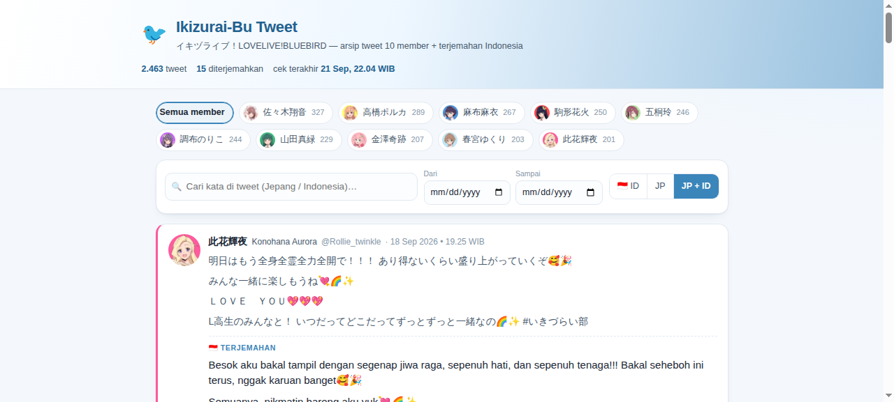

# 🐦 Ikizurai-Bu Tweet

Bot + website arsip untuk tweet 10 member **イキヅライブ！LOVELIVE!BLUEBIRD** (IkizuLive) — lengkap dengan **terjemahan bahasa Indonesia otomatis** dan **notifikasi Discord**.

> Proyek penggemar non-resmi. Semua konten tweet adalah milik ©プロジェクトイキヅライブ！/ 株式会社KADOKAWA.

**🌐 Viewer publik:** https://wawiwuwawu.github.io/Ikizurai-Bu-tweet/ *(tanpa server — dibangun dari dataset JSON di repo ini)*



---

## ℹ️ Tentang data & terjemahan

- **Sumber data:** arsip X publik 10 member IkizuLive di [`gsm-app.com/lovelive/ikizulive-x-archive`](https://gsm-app.com/lovelive/ikizulive-x-archive/). Bot memantau arsip tersebut dan menyimpan tweet baru (beserta media & metadata) ke database SQLite.
- **Terjemahan:** dibuat otomatis oleh **model AI** — praktis untuk memahami isi tweet, tapi **tidak 100% akurat** (bisa ada nuansa yang hilang, istilah yang kurang pas, atau kesalahan kecil). Teks Jepang aslinya selalu ditampilkan berdampingan di notifikasi dan viewer, jadi pembaca bisa menilai sendiri.
- **Dataset lengkap** (tweet + terjemahan) tersedia sebagai JSON di folder [`dataset/`](dataset/) — silakan dipakai untuk riset, mirror, atau terjemahan versi lain. Tidak perlu menjalankan scraper.

---

## ✨ Fitur

- **📡 Scraper otomatis** — memantau arsip X publik dan menyimpan tweet baru ke database SQLite (idempoten, anti-duplikat).
- **🇯🇵→🇮🇩 Translasi otomatis** — via gateway OpenAI-compatible (OmniRoute), batch 5 tweet/request, hasil rapi & natural (emoji, kaomoji, baris kosong, hashtag dipertahankan).
- **🔔 Notifikasi Discord webhook** *(fitur utama)* — satu pesan per tweet:
  ```
  高橋ポルカ · @polka_lion
  Tweet baru dari 高橋ポルカ (Takahashi Polka)
  どうしよう
  高校落ちた
  ━━━━━━━━━━━━━━
  🇮🇩 Terjemahan:
  Gimana ya…

  Aku nggak keterima SMA…
  🐦 IkizuLive X Archive • 14/03/2025 7:56 PM
  ```
  Warna embed = warna resmi karakter, avatar member, link ke tweet asli di judul + author.
- **🖥️ Web viewer** — React satu halaman: filter member, pencarian (JP & ID), rentang tanggal, toggle ID/JP/JP+ID, infinite scroll.
- **🐳 Docker** — satu container (backend + worker + frontend build).

## 🏗 Arsitektur

```
┌──────────────────────── ikizurai-bu-tweet (Docker) ─────────────────────────┐
│  FastAPI :8097                                                              │
│   ├── worker thread   cek sumber → simpan → translate → notify Discord      │
│   │                   └─ ekspor dataset JSON (dataset/)                     │
│   ├── /api/*          data untuk frontend                                   │
│   └── /               frontend React (hasil build)                          │
│                            │                                                │
│  volume ./data/archive.db  │  volume ./dataset/*.jsonl                     │
└────────────────────────────┼────────────────────────────────────────────────┘
                             ▼
              Discord webhook  →  channel penggemar

  dataset/ (JSON) ──commit otomatis──► GitHub ──GitHub Actions──► GitHub Pages
                                        (viewer static, tanpa server)
```

## 📦 Dataset publik (`dataset/`)

Semua tweet + terjemahan diekspor otomatis ke JSON, di-commit ke repo supaya siapa pun bisa memakainya **tanpa menjalankan scraper atau memanggil API translasi**:

| File | Isi |
|---|---|
| `dataset/tweets/YYYY-MM.jsonl` | satu tweet per baris, urut naik (created_at, id_str) |
| `dataset/members.json` | 10 member — nama JP/romaji, warna resmi, jumlah tweet, avatar |
| `dataset/stats.json` | ringkasan (total, jumlah diterjemahkan, rentang tanggal) |
| `dataset/index.json` | manifest bulan + hitungan (dipakai viewer mode static) |

Contoh satu baris `dataset/tweets/2025-03.jsonl`:

```json
{"id_str":"1900531357174128835","member":"polka_lion","member_name":"高橋ポルカ@いきづらい部！",
 "created_at":"2025-03-14T12:56:00.000Z","text":"どうしよう\n\n高校落ちた\n\nどうしようどうしようどうしよう",
 "text_id":"Gimana ya…","favorite_count":2090,"conversation_count":46,
 "url":"https://x.com/polka_lion/status/1900531357174128835"}
```

**Pakai ulang datanya** (impor ke DB lokal lengkap dengan terjemahan):

```bash
cd backend
DB_PATH=/tmp/mirror.db .venv/bin/python -m tools.seed --from-jsonl ../dataset/tweets
# → 2463 tweet + seluruh terjemahan, tanpa satu pun panggilan API
```

**Menghasilkan ulang dataset** (dari DB yang sudah ada):

```bash
docker exec ikizurai-bu-tweet python -m app.worker --export   # manual
# atau otomatis: EXPORT_ON_CYCLE=true (default) → ekspor tiap siklus worker
./ops/publish.sh                                              # commit + push ke GitHub
```

> Commit otomatis: `ops/publish.sh` hanya membuat commit bila isi dataset berubah (diff-friendly, tanpa commit kosong).

## 🚀 Quick Start (Docker)

```bash
git clone https://github.com/wawiwuwawu/Ikizurai-Bu-tweet.git
cd Ikizurai-Bu-tweet
cp backend/.env.example backend/.env
# isi DISCORD_WEBHOOK_URL & OMNIROUTE_API_KEY
docker compose up -d --build
```

Buka `http://localhost:8097` — bot otomatis **backfill seluruh arsip** saat pertama kali jalan (semua tweet lama tidak dikirim ke Discord, hanya tweet baru).

## ⚙️ Konfigurasi (`backend/.env`)

| Variabel | Default | Keterangan |
|---|---|---|
| `SOURCE_BASE` | `https://gsm-app.com/lovelive/ikizulive-x-archive` | Sumber data arsip |
| `DISCORD_WEBHOOK_URL` | — | **Wajib.** Webhook notifikasi |
| `CHECK_INTERVAL_MINUTES` | `10` | Interval pengecekan tweet baru |
| `OMNIROUTE_BASE_URL` / `OMNIROUTE_API_KEY` | — | Gateway translasi (OpenAI-compatible) |
| `TRANSLATE_MODEL` | `atria/Atria-Dawn-Preview` | Model terjemahan |
| `TRANSLATE_MODEL_FALLBACK` | *(kosong)* | Model cadangan bila model utama macet |
| `TRANSLATE_REASONING_EFFORT` | `none` | **Penting** untuk model reasoning — lihat `docs/research/atria_test_report.md` |
| `TRANSLATE_BATCH_SIZE` | `5` | Jumlah tweet per request translasi |
| `TRANSLATE_BATCH_PER_CYCLE` | `20` | Batas batch per siklus (backfill) |
| `TRANSLATE_PAUSED` | `false` | Set `true` untuk berhenti menerjemahkan sementara |
| `EXPORT_DIR` | `./dataset` | Folder dataset JSON publik (di dalam Docker: `/app/dataset`) |
| `EXPORT_ON_CYCLE` | `true` | Ekspor dataset otomatis di akhir tiap siklus worker |
| `NOTIFY_WITHOUT_TRANSLATION` | `false` | Kirim ke Discord walau belum diterjemahkan |
| `DRY_RUN` | `false` | `true` = cetak payload, tidak benar-benar mengirim |
| `WORKER_ENABLED` | `true` | Matikan worker (web saja) |
| `PORT` | `8097` | Port web |

## 🧰 CLI

```bash
cd backend && source .venv/bin/activate   # atau pakai Docker exec

python -m app.worker --stats              # statistik database
python -m app.worker --export             # ekspor dataset publik (dataset/*.jsonl)
python -m app.worker --backfill           # paksa backfill arsip penuh
python -m app.worker --translate-n 10     # terjemahkan 10 tweet dari antrean (uji kualitas)
python -m app.worker --notify-dry 3       # lihat payload embed (tidak dikirim)
python -m app.worker --send 3             # kirim 3 notifikasi pending (nyata)
python -m app.worker --once               # jalankan satu siklus penuh
```

## 💻 Development

```bash
# backend
cd backend
uv venv .venv && uv pip install -p .venv/bin/python -r requirements.txt
.venv/bin/python -m pytest                # 61 tes
.venv/bin/python -m uvicorn app.main:app --port 8097

# frontend (dev server dengan proxy ke :8097)
cd frontend
npm install && npm run dev                # http://localhost:5173
```

## 📚 Dokumentasi

- [`docs/PLAN.md`](docs/PLAN.md) — rencana implementasi lengkap + hasil riset sumber data.
- [`docs/PLAN-DATA-SHARING.md`](docs/PLAN-DATA-SHARING.md) — rencana publikasi dataset + viewer GitHub Pages.
- [`docs/research/atria_test_report.md`](docs/research/atria_test_report.md) — pengujian model translasi (kenapa `reasoning_effort=none`, riwayat revisi prompt).
- [`docs/research/discord_webhook_research.md`](docs/research/discord_webhook_research.md) — referensi limit & praktik terbaik Discord webhook.

## 🤝 Kontribusi

PR & issue terbuka — lihat [`CONTRIBUTING.md`](CONTRIBUTING.md).

## ⚖️ Lisensi

Kode: [MIT](LICENSE). Konten tweet & karakter: milik pemegang hak masing-masing (proyek イキヅライブ！). Proyek ini non-komersial dan tidak berafiliasi dengan proyek resmi.
